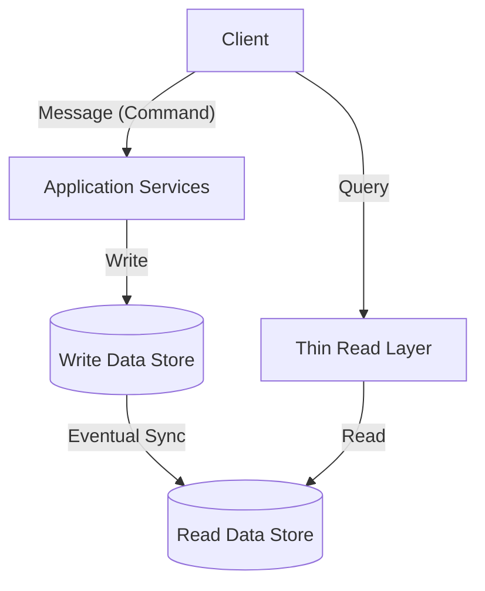

Flowchart

```mermaid
flowchart TD

    Client -->|"Message (Command)"| CmdHandler[Application Services]

    Client -->|Query| ReadLayer[Thin Read Layer]

    CmdHandler -->|Write| WriteDB[(Write Data Store)]

    WriteDB -->|Eventual Sync| DataStore[(Read Data Store)]

    ReadLayer -->|Read| DataStore
```
Then refined in drawio, latex/images/cqrs_architecture