Mermaid Diagram, exported from IntelliIJ 

```mermaid
classDiagram
direction BT
class AssessmentGradeEntity {
    UUID  id
    LocalDateTime  createdAt
    int  grade
    LocalDateTime  updatedAt
    Long  version
}
class AuditLogEntry {
    Long  id
    String  contextJson
    UUID  entityId
    String  entityName
    String  modifiedBy
    String  newValueJson
    String  oldValueJson
    String  operation
    LocalDateTime  timestamp
}
class CourseEntity {
    UUID  id
    LocalDateTime  createdAt
    int  credits
    String  description
    int  minimumCreditsRequired
    String  name
    LocalDateTime  updatedAt
}
class EnrollmentEntity {
    UUID  id
    LocalDateTime  enrollmentDate
}
class LectureAssessmentEntity {
    UUID  id
    AssessmentType  assessmentType
    LocalDateTime  createdAt
    LocalDateTime  updatedAt
    float  weight
}
class LectureEntity {
    UUID  id
    LocalDateTime  createdAt
    LectureStatus  lectureStatus
    int  maximumStudents
    LocalDateTime  updatedAt
    Long  version
}
class LectureWaitlistEntryEntity {
    Long  id
    LocalDateTime  createdDate
}
class ProfessorEntity {
    UUID  id
    String  firstName
    String  lastName
}
class StudentEntity {
    UUID  id
    String  firstName
    String  lastName
    int  semester
}
class TimeSlotValueObject {
    LocalDate  date
    LocalTime  endTime
    LocalTime  startTime
}

AssessmentGradeEntity "0..*" --> "1" LectureAssessmentEntity 
AssessmentGradeEntity "0..*" --> "1" StudentEntity 
CourseEntity "0..*" --> "0..*" CourseEntity
TimeSlotValueObject  --*  LectureAssessmentEntity 
LectureEntity "0..*" --> "1" CourseEntity 
LectureEntity "1" <--> "0..*" EnrollmentEntity 
LectureEntity "1" <--> "0..*" LectureAssessmentEntity 
LectureEntity "1" <--> "0..*" LectureWaitlistEntryEntity 
TimeSlotValueObject  --*  LectureEntity 
LectureWaitlistEntryEntity "0..*" --> "1" StudentEntity 
ProfessorEntity "1" <--> "0..*" LectureEntity 
StudentEntity "1" <--> "0..*" EnrollmentEntity 
```

## Description 
Figure 1 shows an entity relationship diagram for the CRUD app. It shows nine entities and a value object for the app's relational database schema. Each box corresponds to an entity or value object (corresponding to tables on the database), with the bold text being the name. Below the table's name, all attributes of the entity are listed with their type and name. 

Arrows represent an association. The numbers at the end of the arrows convey the multiplicity. For example, an arrow pointing from entity `A` to entity `B` like so: 1 <--> 0..n shows that one `A` can be associated with any number of `B`'s, and a `B` is always associated with exactly one `A`.  An arrow pointing in both directions conveys a bidirectional relationship.

Arrows with a black diamond represent a composition. Compositions are used when an entity has a reference to a value object. This value object has no identity and is directly embedded into the entity.

In the app's ER diagram, the `LectureEntity` serves as core of the schema, having several key associations. The 0..* --> 1 association to `CourseEntity` shows that many lectures can be created from a course and a lecture is always associated with a course. The 0..* --> 1 association to `ProfessorEntity` shows that a professor can hold many lectures (or none), and that a lecture is always associated with a professor. From the lecture's side, these relationships are called "Many to One" relationships. 

`LectureEntity` also has "One to Many" relationships to `LectureWaitlistEntryEntity`, `EnrollmentEntity` and `LectureAssessmentEntity`. `LectureWaitlistEntryEntity` is a table which stores students who are waitlisted for a lecture. It is effectively a join table (with one extra column to track when the student was waitlisted) and represents a Many to Many relationship between lectures and students. The same applies to `EnrollmentEntity` which is a table storing which students are enrolled to which lecture. `LectureAssessmentEntity` represents that a lecture can have many assessments (might be an exam, a paper or a project). Each assessment in turn has many `AssessmentGradeEntity`s associated with it. This table stores which student scored which grade on an assessment. 

The `AuditLogEntry` is also visible on the ER diagram, however it has no relationships. This table and the entire audit log implementation will be laid out in the next section. 
## Rendered from IntelliJ 
Rendered as image from IntellIJ
![[CRUD_ER_Diagram_3.png]]
