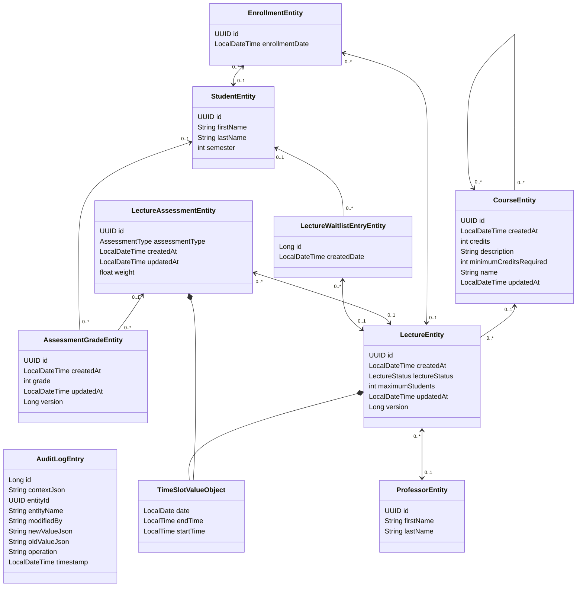

```mermaid
classDiagram
direction BT
class AssessmentGradeEntity {
    UUID  id
    LocalDateTime  createdAt
    int  grade
    LocalDateTime  updatedAt
    Long  version
}
class AuditLogEntry {
    Long  id
    String  contextJson
    UUID  entityId
    String  entityName
    String  modifiedBy
    String  newValueJson
    String  oldValueJson
    String  operation
    LocalDateTime  timestamp
}
class CourseEntity {
    UUID  id
    LocalDateTime  createdAt
    int  credits
    String  description
    int  minimumCreditsRequired
    String  name
    LocalDateTime  updatedAt
}
class EnrollmentEntity {
    UUID  id
    LocalDateTime  enrollmentDate
}
class LectureAssessmentEntity {
    UUID  id
    AssessmentType  assessmentType
    LocalDateTime  createdAt
    LocalDateTime  updatedAt
    float  weight
}
class LectureEntity {
    UUID  id
    LocalDateTime  createdAt
    LectureStatus  lectureStatus
    int  maximumStudents
    LocalDateTime  updatedAt
    Long  version
}
class LectureWaitlistEntryEntity {
    Long  id
    LocalDateTime  createdDate
}
class ProfessorEntity {
    UUID  id
    String  firstName
    String  lastName
}
class StudentEntity {
    UUID  id
    String  firstName
    String  lastName
    int  semester
}
class TimeSlotValueObject {
    LocalDate  date
    LocalTime  endTime
    LocalTime  startTime
}

AssessmentGradeEntity "0..*" --> "0..1" LectureAssessmentEntity 
AssessmentGradeEntity "0..*" --> "0..1" StudentEntity 
CourseEntity "0..*" --> "0..*" CourseEntity 
TimeSlotValueObject  --*  LectureAssessmentEntity 
LectureEntity "0..*" --> "0..1" CourseEntity 
LectureEntity "0..1" <--> "0..*" EnrollmentEntity 
LectureEntity "0..1" <--> "0..*" LectureAssessmentEntity 
LectureEntity "0..1" <--> "0..*" LectureWaitlistEntryEntity 
TimeSlotValueObject  --*  LectureEntity 
LectureWaitlistEntryEntity "0..*" --> "0..1" StudentEntity 
ProfessorEntity "0..1" <--> "0..*" LectureEntity 
StudentEntity "0..1" <--> "0..*" EnrollmentEntity 
```
> Mermaid diagram
## Description 
## Rendered from IntelliJ 
![[CRUD_ER_Diagram_2.png]]