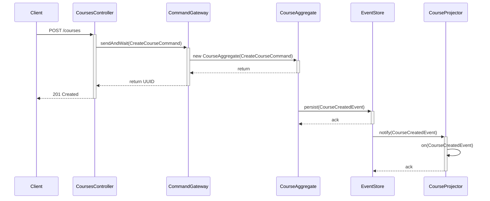

## Full text
### Architecture Overview
The architecture of the `impl-es-cqrs` application differs from the traditional layered architecture seen in the `impl-crud` application. While the CRUD implementation also has some vertical slicing, the ES-CQRS implementation is much more explicit about it. The code is organized into "features", each representing a vertical slice of the application's functionality (e.g., `course`, `enrollment`, `lectures`). Each feature is self-contained and includes its own command handlers, event sourcing handlers, query handlers, and its own web controller, if needed.

A "feature slice" architecture is descriptive and able to communicate the features of a project at a glance. As clean architecture is not in the scope of this thesis, the separation into features with clear naming conventions for command and query components is sufficient, however introducing completely separate modules for the command and read sides would have increased the project structure's readability even more by clearly showing how command and read side have no access to each other. 
### The API Layer
The `api` modules in each feature slice serves is shared between web controllers, command and read side, containing the public interface of the application. It defines the Commands, Events, and Queries that are dispatched and handled by the `impl-es-cqrs` application. This separation ensures that the internal implementation details of the `impl-es-cqrs` application are not exposed to its clients. 
### Command Side
The command side is responsible for handling state changes in the application. It is implemented using Axon's Aggregates, Command Handlers, and Sagas. 
#### Aggregates and Set-Based Validation
Aggregates are the core components of the command side. They represent a consistency boundary for state changes. In this implementation, an example of an aggregate is the `CourseAggregate`. It handles the `CreateCourseCommand`, validates it, and if successful, emits a `CourseCreatedEvent`. 

A core aspect of the validation within the `CourseAggregate` is set-based validation. Before creating a course, the system must verify that all the specified prerequisite courses actually exist. This is handled by the `ICourseValidator`, which is injected into the aggregate's command handler. The validator uses an SQL lookup table that is maintained by the `CourseLookupProjector`. This ensures that the command is validated against a consistent view of the system's state. It is important to note that while projectors typically belong to the read side, "lookup projectors" in this application belong to the command side. They are independent to the read side and maintain their own view of the system. This view is not eventually consistent, but strongly consistent, making this approach suitable for command validation. A strongly consistent projection / lookup table is achieved through the use of _subscribing event listeners_, which are executed immediately after an event has been applied. 
#### External Command Handlers
Not all commands can be handled by a single aggregate. For instance, assigning a grade to a student for a specific lecture involves the `EnrollmentAggregate` and the `LectureAggregate`. In such cases, a dedicated command handler, `EnrollmentCommandHandler`, is used. This handler coordinates the interaction between the aggregates. It loads the `EnrollmentAggregate` from the event sourcing repository, validates the command (e.g., checking if the professor is allowed to assign a grade for the lecture), and then executes the command on the aggregate. 
#### Sagas for Process Management
Sagas are used to manage long-running business processes that span multiple aggregates. The `AwardCreditsSaga` is a prime example. It is initiated when an `EnrollmentCreatedEvent` occurs. The saga then waits for a `LectureLifecycleAdvancedEvent` with the status `FINISHED`. Once this event is received, the saga sends an `AwardCreditsCommand` to the `EnrollmentAggregate`. The saga ends when it receives a `CreditsAwardedEvent`. This ensures that credits are only awarded after a lecture is finished and all assessments have been graded. It is interesting to note that while the CRUD application calculates awarded credits based on the current state of a lecture, in the ES-CQRS implementation, the fact that credits are awarded after finishing a lecture is explicit. Even when changing the Saga later on, credits which have already been awarded will not be revoked, unless additional, explicit logic is implemented (e.g. by applying a `CreditsRevokedEvent`). // TODO keep elaborating on traceability here, OR move it to the end / Fazit. 
### Read Side
The read side listens to events asynchronously and builds read models, called "projections", which are views of the system. A component that listens for events and maintains projections is called a "projector". Projections are designed to answer specific questions about the system: each projector saves exactly the necessary information. This is achieved by using denormalized data models, a contrast to typical CRUD systems that follow normalization rules. 

When the system is queried, the queries are routed to the read side. The read side can efficiently fetch data from the projections, usually without `JOINs`. This makes reads fast. It is important to keep in mind that projections are built asynchronously, meaning they are eventually consistent and may not always reflect the latest changes applied by the command side.

In the context of the ES-CQRS implementation, a good example of a projector that stores denormalized data for efficient querying is the `LectureProjector`. It demonstrates the fact that each projector maintains its own view of the system. Projectors must not query the system using Axon's `queryGateway` to get access to any data needed for the projection. One reason for that is the fact that when _rebuilding_ projections, a common use case in event sourcing, the projectors should be able to run in parallel. If projectors depend on each other, this can result in one projection attempting to query data from another projection that is not yet up to date. This is why the `LectureProjector` not only maintains a view of lectures, but also of courses, professors and students, which are then used when building the lecture's projection. 

The projector also illustrates how the projection's database entities are designed: they are built in the same way as the DTO which is returned from the query handler. Arrays and associated objects are not stored via foreign keys but are instead serialized to JSON. This allows the retrieval of all the necessary data to respond to a query with a simple `SELECT` statement. The same concepts apply to all other projectors in the ES-CQRS implementation. 
### Synchronous Responses with Subscription Queries
A common challenge in CQRS and event-driven architectures is providing synchronous feedback to users. For example, when a student enrolls in a lecture, they expect an immediate response indicating whether they were successfully enrolled or placed on a waitlist. However, commands are usually handled asynchronously. In CQRS, commands are also not intended to return data. 

To solve this, the `LecturesController` uses Axon's subscription queries. When an enrollment request is received, it sends the `EnrollStudentCommand` and simultaneously opens a subscription query (`EnrollmentStatusQuery`). This query waits for an `EnrollmentStatusUpdate` event. The read-side projector responsible for processing enrollments publishes this update after processing the respective `StudentEnrolledEvent` or `StudentWaitlistedEvent`. The controller blocks for a short period, waiting for this update to be published, and then returns the result to the user. This approach makes the user interface synchronous, while not contradicting with the asynchronous nature of CQRS systems, as the command handling process is unchanged. 

While this approach provides the desired synchronous user experience, it has the downside of coupling the client to the event processing flow. In a typical scenario, one might use WebSockets or other client-side notification mechanisms to inform the user about the result of their action. However, for the context of this thesis, where the focus is on the backend implementation and contract testing, this solution is a pragmatic compromise. // TODO improve this section 
### Encapsulation and API Boundaries
To enforce the separation of concerns and maintain a clean architecture, the internal components of the command and read sides are package-private. For example, the `CourseAggregate` and `CourseProjector` are not accessible from outside their respective feature packages. The public API of the application is exposed through the controllers, which only interact with the `CommandGateway` and `QueryGateway`. This ensures that all interactions with the system go through the proper channels and that internal implementations can be changed without affecting the clients.
### Tracing Request Flow 
This section illustrates the flow of commands and queries through the system. Axon's `commandGateway` and `queryGateway` are used in controllers to decouple them from the internals. The gateways create location transparency: a controller does not need to know where its commands and queries are being routed to. 
#### Command Request: `CreateCourseCommand`
`POST`, `PUT` or `PATCH` requests map to commands. To illustrate the flow of a command through the system, the `POST /courses` endpoint will be used. Upon receiving this request, the controller constructs a `CreateCourseCommand` containing the request data and dispatches it through the `CommandGateway`. This gateway is responsible for routing the command to the appropriate destination, which in this case is the constructor of the `CourseAggregate`. This constructor is annotated with `@CommandHandler`. The command handler verifies that the command is allowed to be executed by performing validation logic. When creating courses, it has to be made sure that all prerequisite courses actually exist. This check is done using set-based validation. If the validation is successful, the aggregate triggers a state change by applying a CourseCreatedEvent via the AggregateLifecycle.apply() method. This action notifies the system of the change and prepares the event for persistence by permanently recording it in the event store.

After being applied, Axon routes the event to all subscribed handlers. The `CourseAggregate`'s `@EventSourcingHandler` is executed, changing the aggregate's internal state. What is worth noting here is that in the case of `CourseAggregate`, only the `id` of the course is set. Other properties of the event, like name or description of the newly created course, are not relevant to the command side. Any read-side projectors with `@EventHandlers` for the `CourseCreatedEvent` are also executed after the event is applied.
#### Diagram: Command Flow Sequence

#### Query Request: `FindAllCoursesQuery`
`GET` requests to the web controllers usually map to queries. For instance, a `GET` request to `/courses` is received by the `CoursesController`. It creates a `FindAllCoursesQuery` instance and sends it to Axon's `QueryGateway`, which routes the query to the appropriate method annotated with `@QueryHandler` that handles `FindAllCoursesQuery`. The query handler method then uses its JPA repository to get all courses, maps them to a list of `CourseDTOs` and returns this list. Once the query is finished, the web controller reads the data and sends it back to the client. 
## Original notes 
First, look at the code structure / architecture and point out differences to the layered CRUD architecture (which is not so strong in my case, because CRUD also has vertical slices).
Show that a more descriptive architecture (by correctly separating read and command side) wouldve been even better.

The "api" package includes shared classes used to interface with the command and read side. They are the only publicly usable classes. 

Show how aggregates represent the command side. Explain set-based validation and how it's implemented. Show EnrollmentCommandHandler: handle commands which include several aggregates outside of the aggregates. Explain Sagas as process managers using AwardCreditsSaga. 

Show how projectors represent the read side. How an event arrives, it gets handled and transformed into the presentation that will later be returned. 

Explain the problem of synchronous responses (for error cases), e.g. enrolling (which expects a "ENROLLED" or "WAITLISTED" response) and how it was solved using subscription queries. Explain that this is a downside due to same contract tests, and typically, it is solved differently. Justify this in the context of the thesis. 

Explain that command side classes are package private so they can not be accessed from anywhere else. Same goes for the read side. The public app API (controllers) never access any of the classes, only API classes. 

Then, show one trace of a command request through the system (controller -> command bus -> command handler -> event emitted -> event sourcing handlers -> read side event handlers). Illustrate this using a diagram. 
Afterwards, show how a read request passes to the read side where denormalized data is stored and returned directly. 
