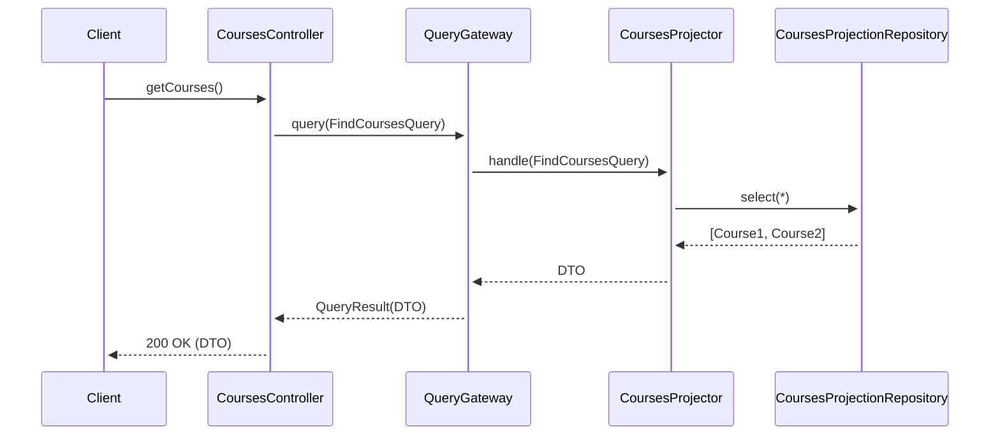

```mermaid
sequenceDiagram

    participant Client

    participant CoursesController

    participant QueryGateway

    participant CoursesProjector

    participant CoursesProjectionRepository

  

    Client ->>+CoursesController: getCourses()

    CoursesController ->>+QueryGateway: query(FindCoursesQuery)

    QueryGateway ->>+ CoursesProjector: handle(FindCoursesQuery)

    CoursesProjector ->>+ CoursesProjectionRepository: select(*)

    CoursesProjectionRepository -->>+ CoursesProjector: [Course1, Course2]

    CoursesProjector -->>+ QueryGateway: DTO

    QueryGateway -->>+ CoursesController: QueryResult(DTO)

    CoursesController -->>+ Client: 200 OK (DTO)
```
![[es-cqrs-query-flow.png]]
...