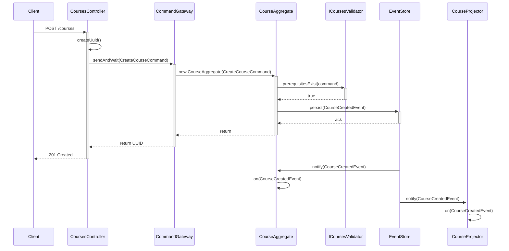

Diagram

```mermaid
sequenceDiagram
    participant Client
    participant CoursesController
    participant CommandGateway
    participant CourseAggregate
    participant ICoursesValidator
    participant EventStore
    participant CourseProjector
  

    Client->>+CoursesController: POST /courses
    CoursesController->>CoursesController:createUuid()
    CoursesController->>+CommandGateway: sendAndWait(CreateCourseCommand)
    CommandGateway->>+CourseAggregate: new CourseAggregate(CreateCourseCommand)
    CourseAggregate->>+ICoursesValidator: prerequisitesExist(command)
    ICoursesValidator-->>-CourseAggregate: true
    CourseAggregate->>+EventStore: persist(CourseCreatedEvent)
    EventStore-->>-CourseAggregate: ack

    CourseAggregate-->>-CommandGateway: return
    CommandGateway-->>-CoursesController: return UUID
    CoursesController-->>-Client: 201 Created

    EventStore->>+CourseAggregate: notify(CourseCreatedEvent)
    CourseAggregate->>+CourseAggregate: on(CourseCreatedEvent)
    EventStore->>+CourseProjector: notify(CourseCreatedEvent)
    CourseProjector->>CourseProjector: on(CourseCreatedEvent)
```

![[es-cqrs-command-flow.png]]