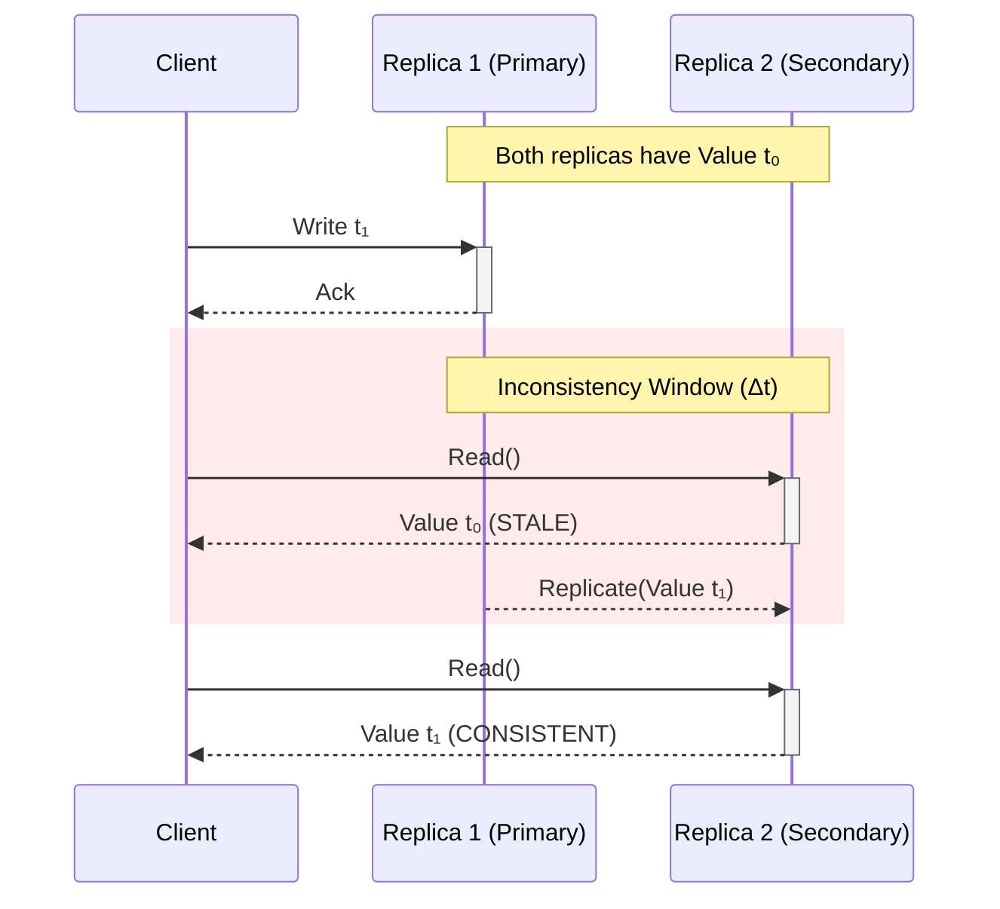

```mermaid 
sequenceDiagram

    participant C as Client

    participant R1 as Replica 1 (Primary)

    participant R2 as Replica 2 (Secondary)

  

    Note over R1, R2: Both replicas have Value t₀

    C->>+R1: Write t₁

    R1-->>-C: Ack

    rect rgb(255, 235, 235)

        Note over R1, R2: Inconsistency Window (Δt)

        C->>+R2: Read()

        R2-->>-C: Value t₀ (STALE)

        R1-->>R2: Replicate(Value t₁)

    end

  

    C->>+R2: Read()

    R2-->>-C: Value t₁ (CONSISTENT)
```
