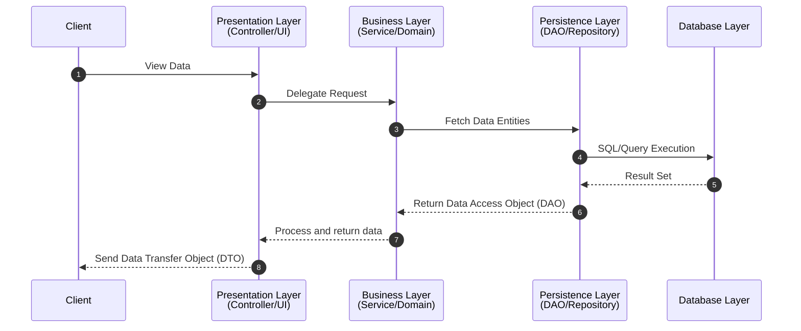

```mermaid
sequenceDiagram

    autonumber

    participant C as Client

    participant P as Presentation Layer<br/>(Controller/UI)

    participant B as Business Layer<br/>(Service/Domain)

    participant D as Persistence Layer<br/>(DAO/Repository)

    participant DB as Database Layer

  

    C->>P: View Data

    P->>B: Delegate Request

    B->>D: Fetch Data Entities

    D->>DB: SQL/Query Execution

    DB-->>D: Result Set

    D-->>B: Return Data Access Object (DAO)

    B-->>P: Process and return data

    P-->>C: Send Data Transfer Object (DTO)
```
